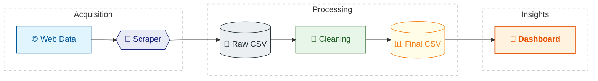
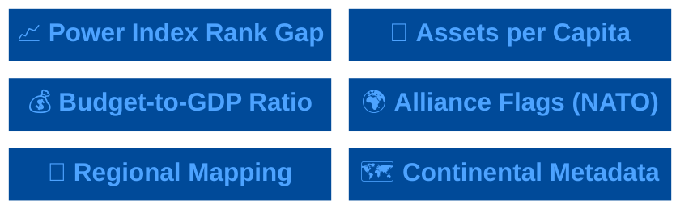

# 🌐 Unified Military Analytics and Comparison Dashboard

[](https://www.python.org/)


[](LICENSE)
---

Unified Military Analytics & Comparison Dashboard shows the military strength of countries in an easy-to-understand way, It uses data to create dashboards that let you compare countries and see key statistics.

---

## 📖 Table of Contents
* [🎯 Project Statement](#-project-statement)
* [⚙️ Approach](#️-approach)
* [🏗️ Architecture](#️-architecture)
* [📂 Repository Structure](#-repository-structure)
* [🗓️ Milestones](#️-milestones)
    * [📍 Milestone 01: Data Collection & Preparation](#-milestone-01-data-collection--preparation)
    * [📍 Milestone 02: KPI Engineering & Prototyping](#-milestone-02-kpi-engineering--prototyping)

---

## 🎯 Project Statement
This project develops a **fully interactive dashboard suite** for analyzing **global military power**.  

- Military metrics for **140+ countries** are scraped from **GlobalFirepower.com**.  
- Python pipelines are used to **scrape, clean, and process** defense data.  
- Dashboards are **cross-platform**: deployable in **Power BI, Tableau, or Python-based apps** (Streamlit/Dash).  
- Covers **50+ defense & economic indicators** across four modules:

| Module | Description |
|--------|-------------|
| **Quick Stats 📊** | Global overview with rankings, trends, KPIs |
| **Nation Overview 🏛️** | Detailed country-level metrics |
| **Compare Powers ⚔️** | Side-by-side country comparison |
| **Coalition Builder 🤝** | Interactive simulation of alliances |

**KPIs include:** Power Index Rank Gap, Assets per Capita, Defense Budget-to-GDP Ratio.

---

## ⚙️ Approach
1. **Data Collection & Preparation** – Scrape and clean data; handle missing values.  
2. **KPI Engineering** – Compute derived metrics; enrich with region, continent, and alliance data.  
3. **Dashboard Development** – Build interactive **Power BI dashboards** with filters, tooltips, and KPI cards.  

---

## 🏗️ Architecture


## 📂 Repository Structure

```
Unified Military Analytics and Comparison Dashboard
│
├── 📄 README.md
│
├── 📂 Milestone_01             
│   ├── Milestone_01_Data_Preprocessing.ipynb
│   ├── README.md
│   └── data/
│       └── military_raw_data.csv
|       └── military_clean_data.csv
│
├── 📂 Milestone_02             
│   ├── Milestone_02_KPI_Engineering.ipynb
│   ├── README.md
│   └── data/
│       └── military_updated.csv
```
---

## 🗓️ Milestones

### 📍 Milestone 01: Data Collection & Preparation
> **Goal:** Build a robust data pipeline that extracts raw military intelligence from the web and transforms it into a high-quality, analysis-ready dataset.


| Module | Focus | Primary Tools |
| :--- | :--- | :--- |
| **01. Scraping** | Web Extraction & Raw Storage | `BeautifulSoup`, `Requests` |
| **02. Cleaning** | Type Conversion & Normalization | `Pandas`, `NumPy` |


| 🧩 Scraping | 🧹 Cleaning |
| :--- | :--- |
| **Action:** Extracted 60+ metrics for 140+ nations. | **Action:** Stripped symbols (%, +) & handled nulls. |
| **Tech:** `BeautifulSoup` + `Requests` | **Tech:** `Pandas` + `NumPy` |
| **Output:** `military_raw_data.csv` | **Output:** `military_cleaned.csv` |

---

### 📍 Milestone 02: KPI Engineering & Prototyping
> **Goal:** Transform raw numbers into strategic military intelligence through custom feature engineering and UI/UX design.




| 🧪 **KPI Engineering** | 🎨 **Prototyping** |
| :--- | :--- |
| **Focus:** Metric Derivation & Metadata | **Focus:** Wireframing & UX Planning |
| **Action:** Calculated Power Gap, Assets/Capita, & Budget/GDP ratio. | **Action:** Drafted layouts for Quick Stats & Nation Overview. |
| **Tech:** `Power BI` | **Tech:** `Figma` / `Sketch` |
| **Output:** `military_final.csv` | **Output:** Dashboard Storyboard |
